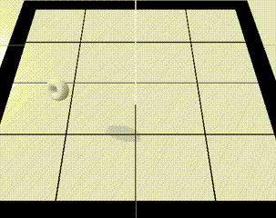
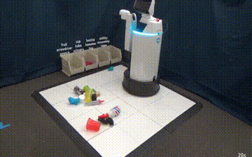

# DIRL: Domain-Invariant Representation Learning

Domain-Invariant Representation Learning (DIRL) is a novel algorithm that semantically aligns both the marginal and the conditional distributions across source and target enviroments. For more details, please visit the [DIRL webpage](https://www.sites.google.com/view/dirl)

<p align="middle">
  
   
  
</p>


<table>
  <tr>
    <td></td>
    <td></td>
    <td></td>
  </tr>
</table>
 
 

&nbsp;&nbsp;&nbsp;&nbsp;&nbsp;&nbsp;[[Source Only](./docs/source_only.gif)]&nbsp;&nbsp;&nbsp;&nbsp;&nbsp;&nbsp;[[Marginal Alignment Cross-Label Mismatch](./docs/dann_negative_transfer.gif)]&nbsp;&nbsp;&nbsp;&nbsp;&nbsp;&nbsp;[[Marginal Alignment Label Shift](./docs/dann_label_shift.gif)]&nbsp;&nbsp;&nbsp;&nbsp;&nbsp;&nbsp;[[DIRL](./docs/dirl_ma_ca_triplet.gif)]

## Getting Started
Follow the instructions to get started after cloning the repository (tested with python3, Ubuntu 16.04, cuda 9.0):

```
virtualenv --python=/usr/bin/python3 env_dirl
source env_dirl/bin/activate

pip install -r requirements.txt
python setup.py develop
```

## Examples

Below we provide a couple of examples to illustrate the efficiency of the DIRL algorithm in learning invariant feature representations with unseen out of training distribution target environments. Customize your results by adjusting the settings and hyperparameters in the respective config files in the `configs` folder.
 
### 2D Synthetic Domain

```
CUDA_VISIBLE_DEVICES=0 python src/train_synthetic_2d.py -model dirl -num_target_labels 8 
```

Results are saved in the `results` folder with respective `.yml` config, `results/figs` and `results/animations` folder.

Vary the number of target examples `num_target_examples` and `-mode` among `[source_only, dann, triplet, dirl]`  to analyse  the performance of the algorithm.

### Digits Bechmarks 

```
CUDA_VISIBLE_DEVICES=1 python src/train_digits.py -mode dirl -source mnist -target mnistm -num_target_labels 10 -save_results True
```
Results are saved in `results` folder with the respective `.yml` config.

Vary the `-source` and `-target` options among `[mnist, mnistm, svhn, usps]`. 

`-mode` and `-num_target_labels` can be changed similarly as above.


